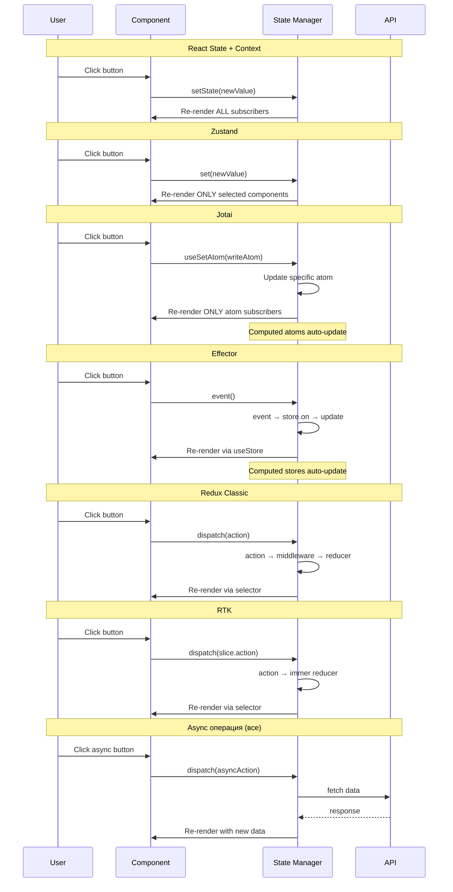

# ⚛️ React State Management Comparison

Проект для сравнения различных подходов к управлению состоянием в React приложениях.

## 🎯 Цель проекта

Наглядная демонстрация работы с различными state менеджерами через одинаковый функционал:
- Счетчик с синхронными операциями
- Асинхронные операции (increment с задержкой)
- Загрузка данных с API (список пользователей)
- Производные значения (computed values)

## 🚀 Быстрый старт

```bash
# Установка зависимостей
npm install

# Запуск dev сервера
npm run dev

# Сборка для продакшена
npm run build
```

## 📂 Структура проекта

```
src/
├── examples/
│   ├── react-state/         # React State + Context API
│   │   ├── CounterContext.jsx
│   │   └── ReactStateExample.jsx
│   ├── zustand/             # Zustand
│   │   ├── store.js
│   │   └── ZustandExample.jsx
│   ├── jotai/               # Jotai (атомарный подход)
│   │   ├── store.js
│   │   └── JotaiExample.jsx
│   ├── effector/            # Effector (реактивный подход)
│   │   ├── model.js
│   │   └── EffectorExample.jsx
│   ├── redux/               # Redux Classic
│   │   ├── store.js
│   │   └── ReduxExample.jsx
│   └── rtk/                 # Redux Toolkit
│       ├── store.js
│       └── RTKExample.jsx
├── App.jsx                  # Главный компонент с навигацией
├── main.jsx                 # Entry point
└── index.css                # Глобальные стили
```

## 🔍 Сравнение подходов

### 1. React State + Context API

**Плюсы:**
- ✅ Встроенное решение, не требует дополнительных библиотек
- ✅ Простота для небольших приложений
- ✅ Идеально для prop drilling проблемы

**Минусы:**
- ⚠️ Все подписчики Context перерендериваются при любом изменении
- ⚠️ Сложнее масштабировать для больших приложений
- ⚠️ Требует оборачивания компонентов в Provider

**Когда использовать:** Маленькие-средние проекты, простое состояние, локальные данные

---

### 2. Zustand

**Плюсы:**
- ✅ Минималистичный API, очень простой в использовании
- ✅ Не требует Provider, работает как обычный хук
- ✅ Селекторы предотвращают лишние перерендеры
- ✅ Отличная производительность
- ✅ Маленький размер (~1kb)
- ✅ Middleware для DevTools, persist и других фич

**Минусы:**
- ⚠️ Меньшая экосистема по сравнению с Redux
- ⚠️ Меньше инструментов для debugging

**Когда использовать:** Современные проекты любого размера, когда нужна простота и производительность

---

### 3. Jotai

**Плюсы:**
- ✅ Атомарный подход - состояние разбито на независимые атомы
- ✅ Минималистичный API, похож на useState
- ✅ Производные атомы (computed values) из коробки
- ✅ Автоматическая оптимизация ре-рендеров
- ✅ Поддержка async атомов нативно
- ✅ Маленький размер (~3kb)
- ✅ TypeScript first подход
- ✅ Utilities: atomWithStorage, atomFamily

**Минусы:**
- ⚠️ Новая парадигма мышления (атомы вместо глобального store)
- ⚠️ Меньше примеров и туториалов чем у Redux
- ⚠️ Может быть избыточным для простых задач

**Когда использовать:** Проекты где нужна гибкость атомарного подхода, много производных значений, bottom-up архитектура

---

### 4. Effector

**Плюсы:**
- ✅ Реактивный подход с четким разделением Store/Event/Effect
- ✅ TypeScript first - отличная типизация из коробки
- ✅ Effect для async операций с pending/done/fail состояниями
- ✅ Combine и sample для сложной логики и связей между stores
- ✅ Производные store через `.map()`
- ✅ Framework agnostic (работает с React, Vue, Svelte)
- ✅ Отличная производительность
- ✅ Маленький размер (~10kb)
- ✅ DevTools для debugging

**Минусы:**
- ⚠️ Специфичная терминология (Store, Event, Effect, Domain)
- ⚠️ Steep learning curve - сложнее изучить
- ⚠️ Меньше туториалов на русском

**Когда использовать:** Сложные проекты с большим количеством взаимосвязей, нужна строгая типизация, важна производительность

---

### 5. Redux (Classic)

**Плюсы:**
- ✅ Проверенное временем решение (с 2015 года)
- ✅ Предсказуемое управление состоянием
- ✅ Отличные DevTools для дебага
- ✅ Огромная экосистема и community
- ✅ Middleware для расширения функционала

**Минусы:**
- ⚠️ Очень много boilerplate кода (actions, action types, reducers)
- ⚠️ Требует оборачивания в Provider
- ⚠️ Сложнее изучить для новичков
- ⚠️ Нужен дополнительный middleware для async операций

**Когда использовать:** Legacy проекты, сложная бизнес-логика, нужен time-travel debugging

---

### 6. Redux Toolkit (RTK)

**Плюсы:**
- ✅ Официальный рекомендуемый способ использования Redux
- ✅ Значительно меньше boilerplate кода
- ✅ Встроенный Immer для иммутабельных обновлений
- ✅ createAsyncThunk для async операций из коробки
- ✅ Автоматическая генерация action creators
- ✅ DevTools настроены по умолчанию
- ✅ TypeScript поддержка из коробки

**Минусы:**
- ⚠️ Все еще требует Provider
- ⚠️ Несколько концепций для изучения (slices, thunks)
- ⚠️ Больший размер библиотеки

**Когда использовать:** Крупные enterprise проекты, сложная логика, нужны DevTools и middleware

---

## 📊 Таблица сравнения

| Критерий | React State | Zustand | Jotai | Effector | Redux | RTK |
|----------|-------------|---------|-------|----------|-------|-----|
| **Размер** | 0kb (встроенный) | ~1kb | ~3kb | ~10kb | ~8kb | ~12kb |
| **Простота API** | 🟢 Простой | 🟢 Очень простой | 🟢 Простой | 🔴 Сложный | 🔴 Сложный | 🟡 Средний |
| **Boilerplate** | 🟡 Средний | 🟢 Минимальный | 🟢 Минимальный | 🟡 Умеренный | 🔴 Много | 🟡 Умеренный |
| **Производительность** | 🟡 Средняя | 🟢 Отличная | 🟢 Отличная | 🟢 Отличная | 🟢 Отличная | 🟢 Отличная |
| **DevTools** | ❌ Нет | 🟡 Через middleware | 🟡 Через middleware | ✅ Есть | ✅ Отличные | ✅ Отличные |
| **TypeScript** | 🟢 Хорошая | 🟢 Отличная | 🟢 Отличная | 🟢 Отличная | 🟡 Средняя | 🟢 Отличная |
| **Async операции** | 🟡 Ручная | 🟢 Встроенная | 🟢 Встроенная | ✅ Effect API | ⚠️ Нужен middleware | 🟢 createAsyncThunk |
| **Computed values** | 🟡 useMemo | 🟡 Селекторы | ✅ Атомы | ✅ .map() & combine | 🟡 Селекторы | 🟡 Селекторы |
| **Экосистема** | ✅ React | 🟡 Растущая | 🟡 Растущая | 🟡 Средняя | ✅ Огромная | ✅ Огромная |
| **Framework agnostic** | ❌ Только React | ✅ Да | ❌ Только React | ✅ Да | ✅ Да | ✅ Да |

---

## 🎨 Архитектура решений

```mermaid
graph TB
    subgraph "React State + Context"
        A[Component] -->|useContext| B[Context Provider]
        B -->|useState| C[Local State]
        C -->|setState| D[Re-render всех подписчиков]
    end
    
    subgraph "Zustand"
        E[Component] -->|useStore с селектором| F[Zustand Store]
        F -->|set| G[State Update]
        G -->|Точечный re-render| H[Только измененные компоненты]
    end
    
    subgraph "Jotai"
        J1[Component] -->|useAtomValue| J2[Atom 1]
        J3[Component] -->|useAtomValue| J4[Atom 2]
        J5[Component] -->|useSetAtom| J6[Write-only Atom]
        J6 -->|updates| J2
        J7[Computed Atom] -->|derives from| J2
        J7 -->|auto re-calc| J1
    end
    
    subgraph "Effector"
        EF1[Component] -->|useStore| EF2[Store]
        EF3[Component] -->|calls| EF4[Event]
        EF4 -->|.on| EF2
        EF5[Effect] -->|async| EF6[API]
        EF5 -->|.doneData| EF2
        EF7[Computed Store] -->|.map| EF2
    end
    
    subgraph "Redux Classic"
        I[Component] -->|useSelector| K[Redux Store]
        L[Component] -->|dispatch| M[Action]
        M --> N[Reducer]
        N -->|return new state| K
        K -->|subscribe| I
        O[Middleware] -.->|intercept| M
    end
    
    subgraph "Redux Toolkit"
        P[Component] -->|useSelector| Q[RTK Store]
        R[Component] -->|dispatch| S[Slice Action]
        S --> T[Immer Reducer]
        T -->|auto immutable update| Q
        Q -->|subscribe| P
        U[createAsyncThunk] -->|async logic| S
    end
    
    style A fill:#61dafb
    style E fill:#61dafb
    style J1 fill:#61dafb
    style J3 fill:#61dafb
    style J5 fill:#61dafb
    style EF1 fill:#61dafb
    style EF3 fill:#61dafb
    style I fill:#61dafb
    style L fill:#61dafb
    style P fill:#61dafb
    style R fill:#61dafb
    style F fill:#ffd43b
    style J2 fill:#7c3aed
    style J4 fill:#7c3aed
    style J6 fill:#7c3aed
    style J7 fill:#a855f7
    style EF2 fill:#ff6b35
    style EF4 fill:#ff8c42
    style EF5 fill:#ffa552
        style EF7 fill:#ffb662
    style K fill:#764abc
    style Q fill:#764abc
```



## 🔄 Data Flow сравнение



## 🎯 Рекомендации по выбору

### Выбирайте **React State + Context** если:
- Маленький проект или прототип
- Простое состояние (2-3 значения)
- Не нужны DevTools
- Хотите минимум зависимостей

### Выбирайте **Zustand** если:
- Современный проект любого размера
- Нужна простота и производительность
- Важен маленький размер bundle
- Не нужны сложные middleware

### Выбирайте **Jotai** если:
- Нужна максимальная гибкость
- Много производных значений (computed)
- Bottom-up подход к архитектуре
- Нравится атомарная парадигма Recoil
- Нужны утилиты типа atomFamily

### Выбирайте **Effector** если:
- Сложная бизнес-логика с множеством взаимосвязей
- Нужна строгая типизация TypeScript
- Важна максимальная производительность
- Планируете использовать разные фреймворки
- Нравится реактивный подход с Event/Store/Effect

### Выбирайте **Redux Classic** если:
- Поддерживаете legacy код
- Нужны специфичные middleware (saga и т.д.)
- Уже есть опыт с Redux
- Не планируете миграцию

### Выбирайте **RTK** если:
- Enterprise проект
- Сложная бизнес-логика
- Нужны DevTools и time-travel
- Работаете с TypeScript
- Нужен RTK Query для API

---

## 🛠️ Технологии

- **React 18** - UI библиотека
- **Vite** - сборщик и dev сервер
- **Zustand 4** - минималистичный state manager
- **Jotai 2** - атомарный state manager
- **Effector 23** - реактивный state manager
- **Redux 5** - предсказуемый state container
- **Redux Toolkit 2** - современный Redux
- **React-Redux 9** - официальные React bindings

---

## 📚 Дополнительные ресурсы

### React State + Context
- [React Context API Docs](https://react.dev/reference/react/useContext)
- [useState Docs](https://react.dev/reference/react/useState)

### Zustand
- [Official Docs](https://github.com/pmndrs/zustand)
- [Zustand Middleware](https://github.com/pmndrs/zustand#middleware)

### Jotai
- [Official Docs](https://jotai.org/)
- [Jotai Utilities](https://jotai.org/docs/utilities/atom-with-storage)

### Effector
- [Official Docs](https://effector.dev/)
- [Effector React](https://effector.dev/en/api/effector-react/)

### Redux
- [Redux Core Docs](https://redux.js.org/)
- [Redux Style Guide](https://redux.js.org/style-guide/)

### Redux Toolkit
- [RTK Docs](https://redux-toolkit.js.org/)
- [RTK Query](https://redux-toolkit.js.org/rtk-query/overview)

---

## 💡 Выводы

**Для новых проектов:**
- Маленькие проекты → **React State**
- Средние проекты → **Zustand** или **Jotai**
- Крупные проекты → **RTK** или **Effector**

**По философии:**
- Top-down подход (один store) → **Zustand**, **Redux**, **RTK**
- Bottom-up подход (атомы) → **Jotai**
- Реактивный подход (события) → **Effector**
- Гибридный подход → **React State + Context**

**По сложности изучения:**
- Легко: **React State**, **Zustand**, **Jotai**
- Средне: **RTK**
- Сложно: **Redux Classic**, **Effector**

**Главное правило:** Выбирайте инструмент под задачу, а не потому что он модный. Часто React State + Context достаточно для 80% задач.

---

